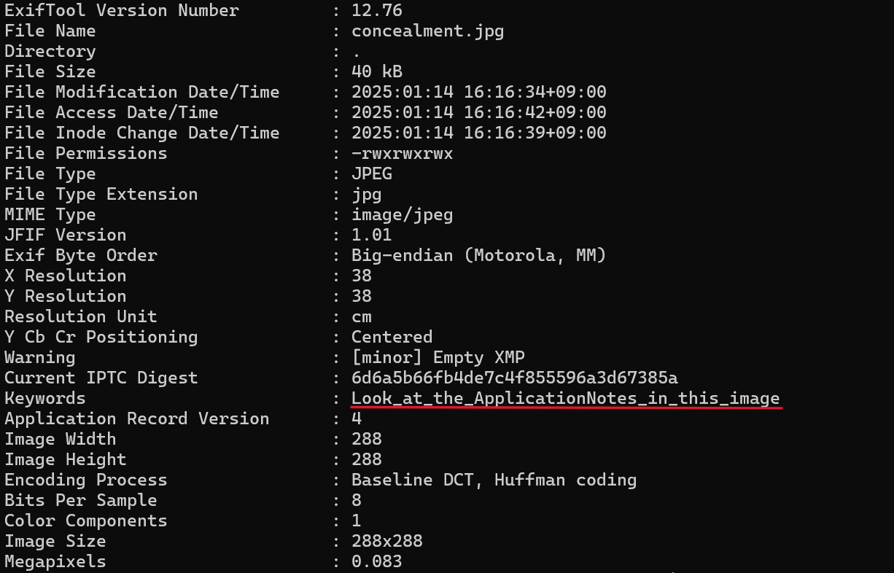

# Concealment

## 問題文

pass:i3ctf

## 解法
画像の中に隠されているFlagを抽出する問題。 

1. 画像のQRコードを読み取るとExifToolのWikipediaが表示される。
2. ExifToolを使って、画像のメタデータを見ると「Look_at_the_ApplicationNotes_in_this_image」というヒントがある。
3. ヒントに従い、「exiftool -ApplicationNotes -b concealment.jpg > output.txt」などの方法でApplicationNotesの中身を抽出すると、ASCIIコードが得られる。
4. これをテキストに変換すると、「Search_for_Steghide」となる。
5. Steghideはステガノグラフィーのツールであり、Steghideの抽出コマンドを使用するとFlagが得られる。なお、抽出の際に要求されるパスワードは問題文に記載してある。

参考サイト 
[Steghideを利用して、画像に機密データを隠してみた！](https://hack-lab-256.com/steganography-steghide/295/)
