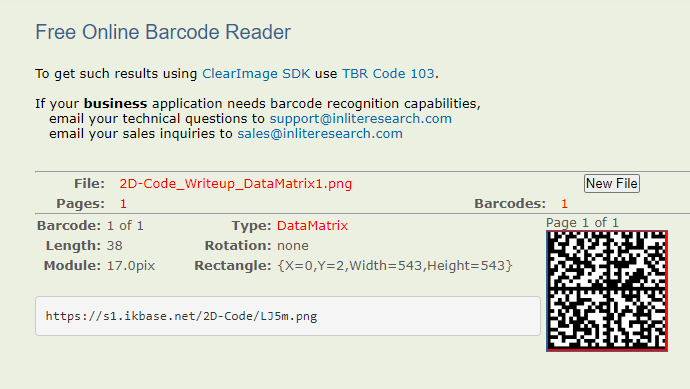

# 2D-Code

## 問題文

I have developed a new two-dimensional code! It has three times the capacity!

## 解法

2D-Code.xlsxを開くとQRコードが表示されているが、そのままでは読み取れない。<br>
注目すべき点は、3つの色が使われていることとQRコードの共通部分だ。<br>
どのQRコードにもファインダパターン、アライメントパターンなどのQRコードを読み取るうえで欠かせないものがある。<br>
3つの色が使われていることとQRコードの共通部分が緑色になっていることから推察できることは以下の通り。

- 2つのQRコードが重なっている
- QRコードの論理和は赤と青、論理積は緑で表現されている

では次にマクロを使い2つのQRコードに分離したい。 <br>
マクロを実行するためには、2D-Code.xlsmに拡張子を変更する必要がある。
```vb
    Dim wsSource As Worksheet
    Dim wsTarget1 As Worksheet
    Dim wsTarget2 As Worksheet
    Dim rngSource As Range
    Dim cell As Range

    ' シートの設定
    Set wsSource = ThisWorkbook.Sheets("Sheet1") ' 元データ
    Set wsTarget1 = ThisWorkbook.Sheets("Sheet3") ' 赤と緑をコピー
    Set wsTarget2 = ThisWorkbook.Sheets("Sheet4") ' 青と緑をコピー

    ' 元データ範囲の設定
    Set rngSource = wsSource.Range("A1:AG33") ' 33x33の範囲（A1からAG33）

    ' 色をチェックしてコピー
    For Each cell In rngSource
        Select Case cell.Interior.Color
            Case RGB(255, 0, 0) ' 赤
                wsTarget1.Cells(cell.Row, cell.Column).Value = cell.Value
                wsTarget1.Cells(cell.Row, cell.Column).Interior.Color = RGB(0, 0, 0)

            Case RGB(0, 255, 0) ' 緑
                wsTarget1.Cells(cell.Row, cell.Column).Value = cell.Value
                wsTarget1.Cells(cell.Row, cell.Column).Interior.Color = RGB(0, 0, 0)

                wsTarget2.Cells(cell.Row, cell.Column).Value = cell.Value
                wsTarget2.Cells(cell.Row, cell.Column).Interior.Color = RGB(0, 0, 0)

            Case RGB(0, 0, 255) ' 青
                wsTarget2.Cells(cell.Row, cell.Column).Value = cell.Value
                wsTarget2.Cells(cell.Row, cell.Column).Interior.Color = RGB(0, 0, 0)
        End Select
    Next cell
```
上記のプログラムの場合、Sheet3とSheet4にQRコードが出力される。


それぞれのQRコードを読み取ると、下記の2枚の画像が手に入る。


2枚目のヒントがとても重要だ。青色の背景の中に青色の「A」という文字が入っている。
一見、何も関係ないヒントにも見えるが、ここで最初のQRコードを見直してほしい。<br>


A1に「8」が入っているがセル上には表示されていない。
つまり背景色と同化して文字が隠されていることがわかる。 <br>
そこで1枚目のヒントを見てほしい。<br>
ASCII(33～126)に変換し、7で割り切れる場合は塗りつぶして11で割り切れる場合は塗りつぶしなしで変換すればよいことがわかる。

```vb
    Dim i As Integer, j As Integer
    Dim asciiValue As Integer
    Dim cell As Range

    ' Sheet1からSheet2にデータをコピー
    Sheet1.Range("A1").Resize(32, 32).Copy Sheet2.Range("A1")

    ' 各セルをチェック
    For i = 1 To 32
        For j = 1 To 32
            Set cell = Sheet2.Cells(i, j)

            ' セルが空でない場合
            If Not IsEmpty(cell) Then
                asciiValue = Asc(cell.Value)

                ' 7の倍数の場合は黒
                If asciiValue Mod 7 = 0 Then
                    cell.Interior.Color = RGB(0, 0, 0)
                ' 11の倍数の場合は白
                ElseIf asciiValue Mod 11 = 0 Then
                    cell.Interior.Color = RGB(255, 255, 255)
                End If
            End If
        Next j
    Next i
```
上記のマクロを実行し、文字を消すと下記のDataMatrixが表示される。

※DataMatrixとは<br>
正方形または長方形のパターンで配置された白黒の「セル」またはドットで構成される二次元コードである。アメリカ合衆国を中心に普及している。<br>

[Wikipedia引用](https://ja.wikipedia.org/wiki/Data_Matrix)


後は、[Barcode Reader](https://online-barcode-reader.inliteresearch.com/) を使用し
DataMatrixを読み取る。<br>




※BONUS POINT(Venue limited)とは<br>
会場限定問題。
会場の展示物を利用したギミックを展示する予定。<br>

