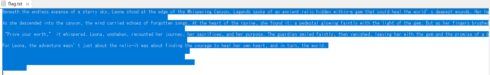

# crib

## 問題文

My fingertips tremble as I hold the confidential file in front of me. The password was “leona”...it was supposed to be. But the authentication was denied, and only silence remained.

## 解法

既知平文攻撃とステガノグラフィの複合問題。<br>

1. zipファイルが配付されるがパスワードを要求され開くことが出来ない。ファイルのバイナリを見ると、「Do you know about known plaintext attacks ?」という記述が確認できる。

2. 「known plaintext attacks」は日本語で「既知平文攻撃」と呼ばれる。zipinfoコマンドなどでzipファイルの中身を確認すると「flag.txt」と「NSALibertyReport.p13.jpg」の二つが確認できる。
```
$ zipinfo secret.zip
Archive:  secret.zip
Zip file size: 193758 bytes, number of entries: 2
-rw-rw-r--  3.0 unx     1330 BX stor 24-Nov-22 10:12 flag.txt
-rw-r--r--  3.0 unx   191987 BX stor 24-Nov-21 16:44 NSALibertyReport.p13.jpg
2 files, 193317 bytes uncompressed, 193317 bytes compressed:  0.0%
```
3. 「NSALibertyReport.p13.jpg」を検索すると[Wikipedia](https://ja.m.wikipedia.org/wiki/%E3%83%95%E3%82%A1%E3%82%A4%E3%83%AB:NSALibertyReport.p13.jpg)から同一のファイルが入手できる。

4. 入手したファイルを使用して下記のサイトを参考に既知平文攻撃を行う。<br>[パスワードをかけても中身を見られてしまうZIPファイルの脆弱性〜既知平文攻撃〜](https://doz13189.hatenablog.com/entry/2017/07/09/131657)

5. 既知平文攻撃を行うと、パスワードが解除されflag.txtをみることができるが、中身は英文が書いてあるだけでFlagは書いていない。しかし、テキストには不自然な空白が確認できる。

6. このファイル以外にFlagがありそうなファイルは存在しないので、テキストファイルに対するステガノグラフィが行われていると推測する。検索すると「Stegsnow」というテキストファイル内にメッセージを隠すツールが見つかる。

7. この問題の問題文を確認すると「leona」というパスワードが出てくる。「Stegsnow」にはパスワードを付けることができ、「leona」をパスワードとしてFlagを入手することができる。<br>
```
$ stegsnow -C -p 'leona' flag.txt
```

参考サイト<br>
[CTFにおけるステガノグラフィ入門とまとめ](https://blog.hamayanhamayan.com/entry/2022/12/14/234257)