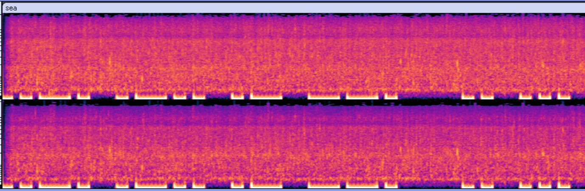

# sea

## 問題文

uncomfortable feeling

Flag format: FLAG{}

## 解法
隠れた音声を解析する問題。 

1. Audacityなどのツールを使い音声を見ると、前半に不審な音が入っているのが分かる。スペクトログラム表記で映像を見るとモールス信号のような音が入っており解読するとFlagが得られる。

 
また、音声を10Hzでフィルタリング→550Hzにピッチを変更したものを下記サイトで複合してもFlagが得られる。(誤認識の可能性あり)

[モールス信号複合サイト](https://morsecode.world/international/decoder/audio-decoder-adaptive.html)