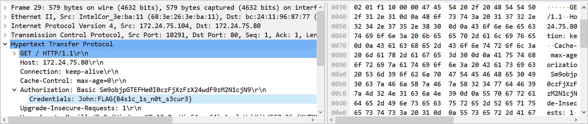

# basic

## 問題文

Is Basic Authentication secure?

## 解法
Basic認証で流れているFlagを入手する問題。 

1. パケットの34行目でhtmlファイルが送信されているのが分かる。
2. htmlファイルを取得できているということは、直前でBasic認証が通っていることが推測できる。
3. 直前のHTTP通信である29行目を見るとFlagが得られる。

