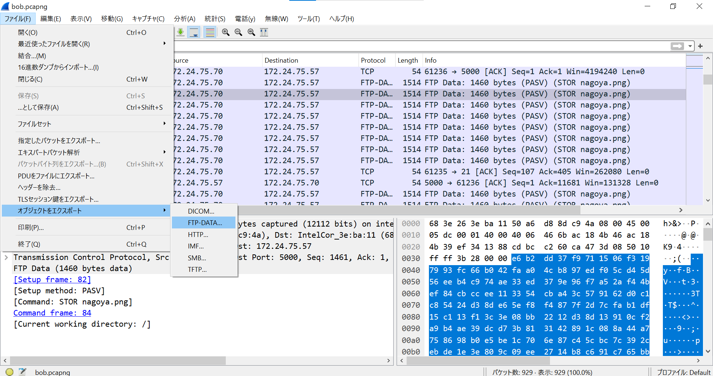
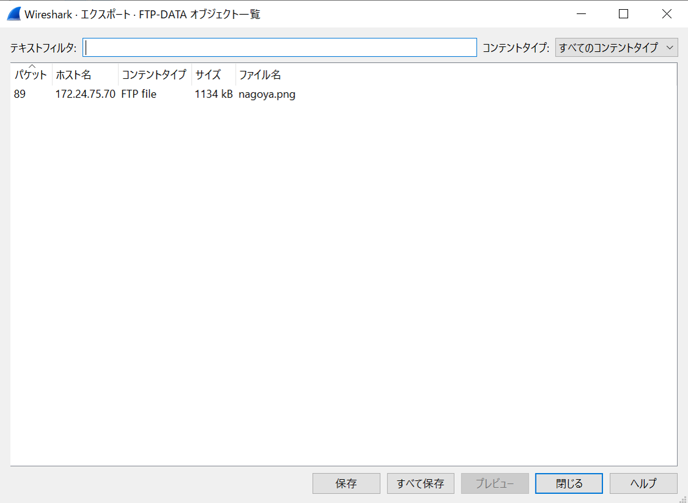

# Bob

## 問題文

Bob, a new engineer, is sipping coffee contentedly after forwarding a classified document. The file may or may not have Flag written on it. Please sneak a peek at his transfer log and find Flag.

## 解法
FTPで送信されているファイルを復元する問題。 

1. ファイル → オブジェクトをエクスポート → FTP-DATAをクリックする。

2. nagoya.pngというファイルが生成されるので保存する。

3. 画像を開くとFlagが得られる。

参考サイト 
[取得したパケットからデータを復元する方法
](https://www.mieruka.link/2020/04/17/wireshark%E9%81%94%E4%BA%BA%E3%81%B8%E3%81%AE%E9%81%93-%E7%AC%AC%E4%B8%80%E6%AD%A9/)

