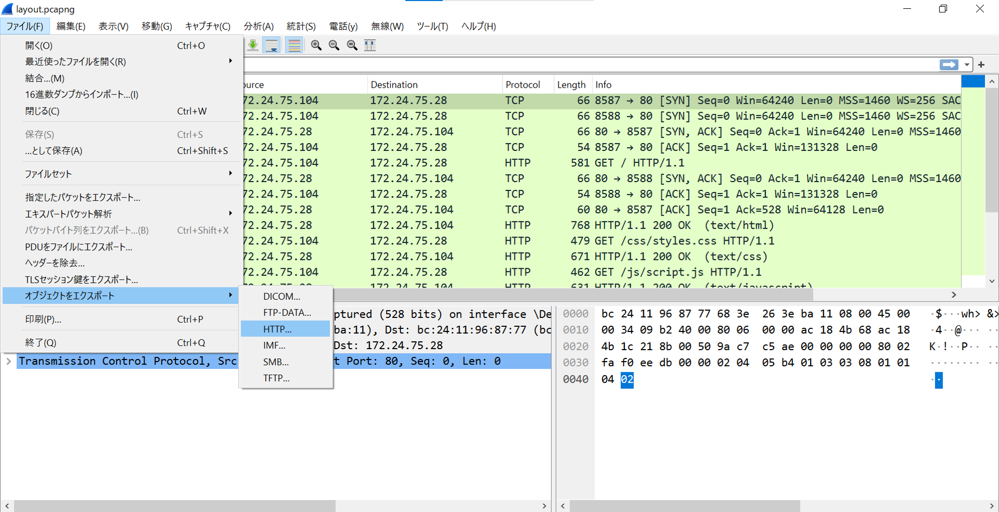

# Layout

## 問題文

```
Layout
├── Layout
│   ├── Layout
│   └── Layout
├── Layout
│   └── Layout
└── Layout
```


## 解法
HTTP通信からWebサイトを復元する問題。<br>

1. ファイル → オブジェクトをエクスポート → HTTPをクリックする。

2. 生成されたファイルを全て保存する。

3. 生成されたhtmlファイルからjsとcssを正しく配置すれば、Flagが得られる。
