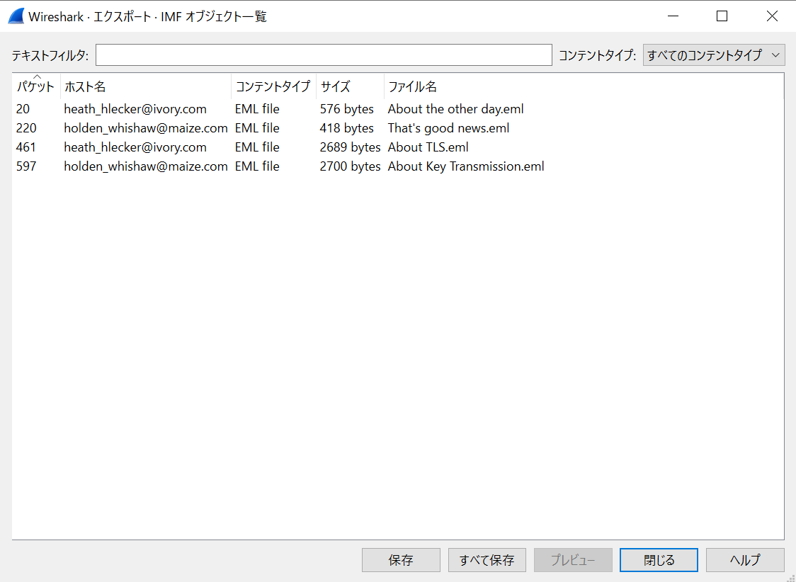
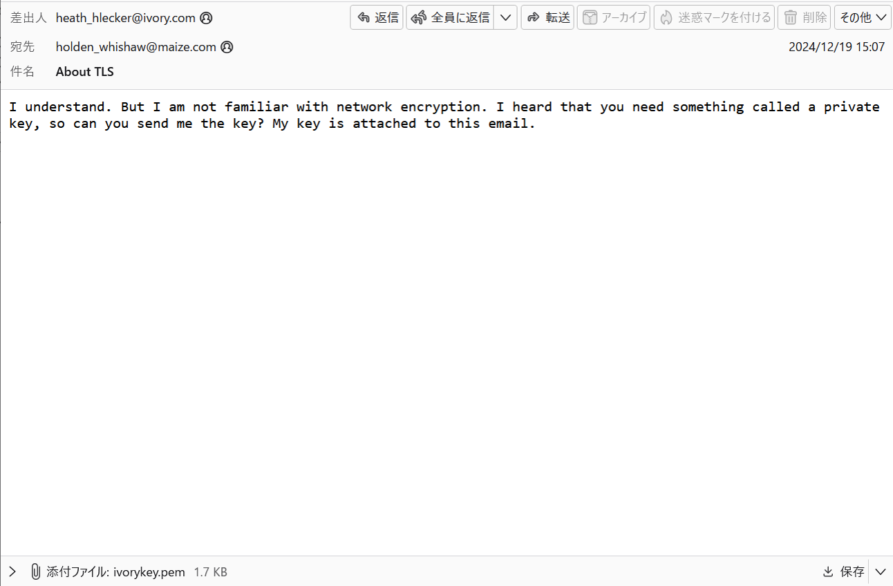
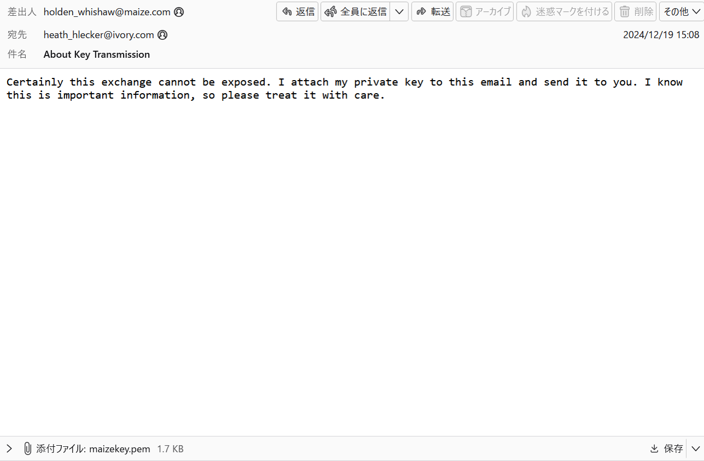
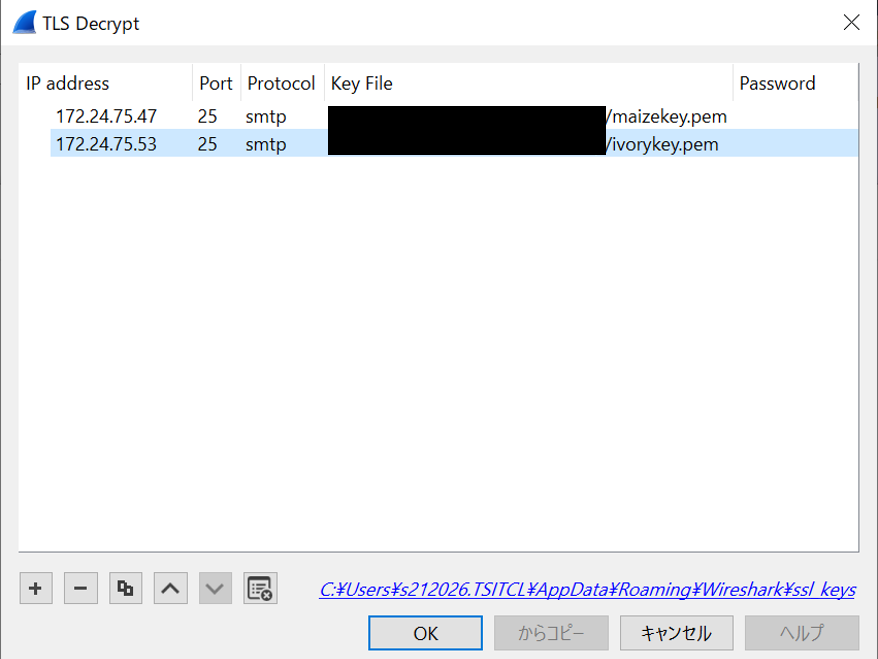
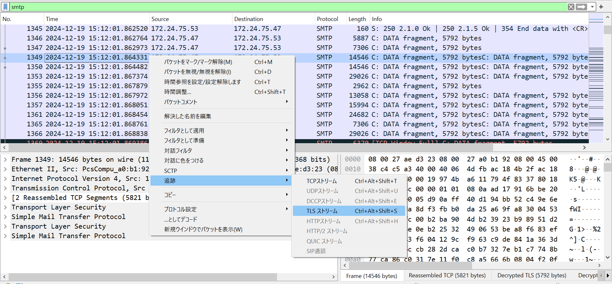

# ppap

## 問題文

We have obtained top secret data on "tare", an important person. I want you to uncover tare's secret in this file.


## 解法
パケットの暗号化を解除し、送信されているファイルから情報を抽出する問題。<br>

1. パケット内には、多数のSMTP通信でメールのやり取りが行われていることが確認できる。その中で互いの秘密鍵を送りあっているパケットがあるので、「ファイル → オブジェクトをエクスポート → IMF」で秘密鍵を２つ入手する。

2. 下記のサイトの秘密鍵を使用したTLS暗号の解除を参考にTLS通信の中身を見れるようにする。今回はメール送信のパケットなので、Portは「25」、Protocolは「smtp」となる。<br>
[WiresharkでのTLS暗号解除方法方法](https://www.toyo.co.jp/ict/casestudy/detail/id=42424)


3. 暗号化を解除したら、大量のデータを送信していることが分かる。そのパケットで追跡 → TLSストリームを選択するとメール形式が出来上がるので、拡張子emlで保存する。emlファイルを開くとzipファイルが入手できる。


4. 手順１と同じことを行い他のメールを見るとzipファイルのパスワードが記載してある。このパスワードを使用するとzipファイルの中にあるpcapファイルを開くことが出来る。pcapファイルを開くと、RTPプロトコルが確認できる。
下記のサイトを参考に、動画を復元する。(payloadを96にする必要あり)<br>
ただし、上部にあるRTP通信を復元するとダミー動画になってしまう。正しい動画は、ダミー動画とは違うポート番号で通信を行っているので、ポート番号が異なるRTPパケットを見つけ、動画を復元するとFlagが得られる。<br>
[RTPパケットから動画を復元する方法](https://community.cisco.com/t5/tkb-%E3%82%B3%E3%83%A9%E3%83%9C%E3%83%AC%E3%83%BC%E3%82%B7%E3%83%A7%E3%83%B3-%E3%83%89%E3%82%AD%E3%83%A5%E3%83%A1%E3%83%B3%E3%83%88/gstreamer-%E3%81%A7-wireshark-%E3%81%AE-rtp-%E3%83%91%E3%82%B1%E3%83%83%E3%83%88%E3%81%8B%E3%82%89%E3%83%93%E3%83%87%E3%82%AA%E3%82%92%E5%86%8D%E7%94%9F%E3%81%99%E3%82%8B%E6%96%B9%E6%B3%95/ta-p/3162522)

以下復元コマンド
```
C:\gstreamer\1.0\msvc_x86_64\bin\gst-launch-1.0 -m -v filesrc location=secret.pcap ! pcapparse src-port=22008 dst-port=39930 ! application/x-rtp,media=video,clock-rate=90000,payload=96application/x-rtp,media=video,clock-rate=90000,payload=96 ! rtpjitterbuffer ! rtph264depay ! avdec_h264 ! videoscale ! video/x-raw, width=1280, height=720 ! videoconvert ! x264enc ! mp4mux ! filesink location=flag.mp4
```


