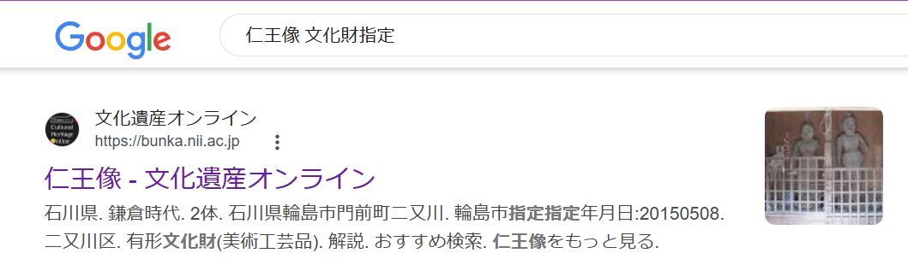
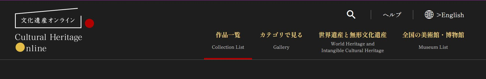
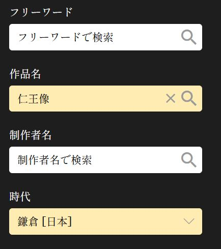
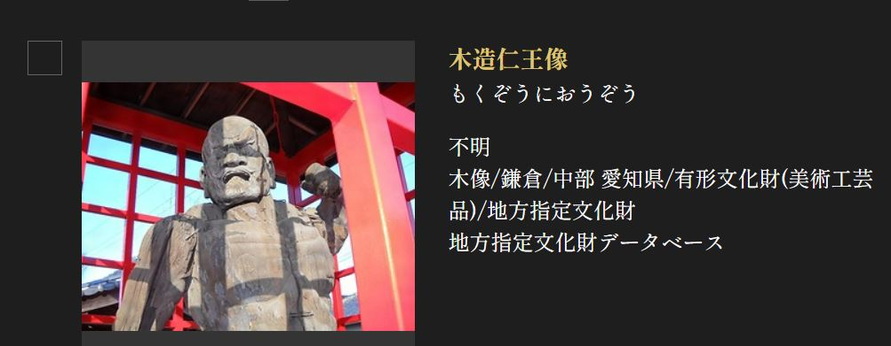

# fuda

## 問題文
What is the name of the temple where this “fuda” is located? 

Flag format: FLAG{temple name} 
Temple names are case insensitive in English. 

## 解法

1.  
画像を確認すると、「仁王」、「鎌倉期」、「指定」の言葉が確認できることから、「仁王像 文化財 指定」等で検索をすると、[文化遺産についてまとめたサイト](https://bunka.nii.ac.jp/)が出てくる。 

 
 
2. サイト内の作品一覧を選び、左の検索欄のフリーワードもしくは作品名に「仁王像」を指定、時代に「鎌倉」を選択し検索をする。
 

 
3. すると木造仁王像1件のみが出てくるため、この仁王像について調べると、明眼院であることが分かる。