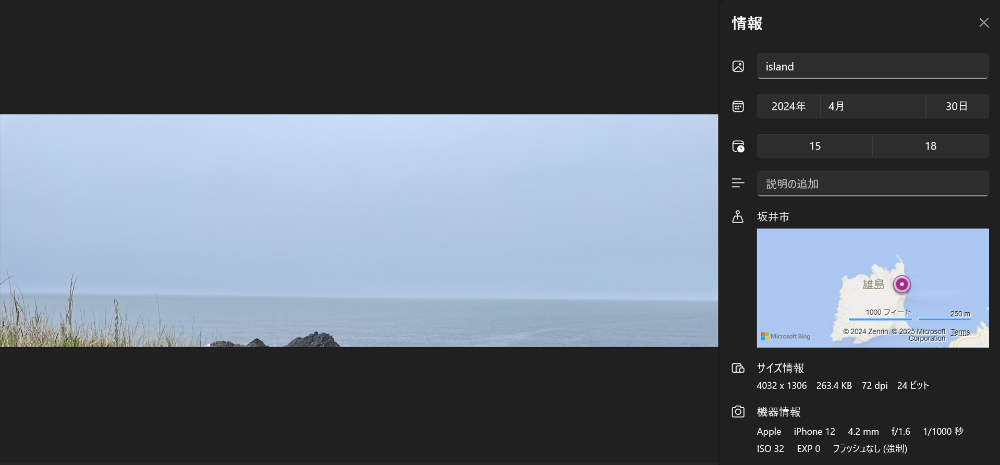

# Island

## 問題文

What is the name of the island where this photo was taken?

Flag format: FLAG{island name} 
<small>*The name of the island is written in English.*</small>

## 解法
画像のメタデータを確認する問題。 

1. フォトなどで画像を開く。

2. ファイル情報を確認すると、写真が撮影された場所が記載してある。(ExifToolなどでも座標を確認可能)

