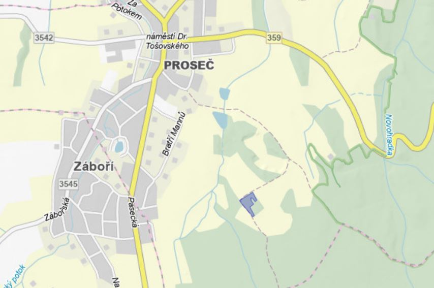

# map

## 問題文
I am the one who lives on this land. Do you see me? Here I am. I am not satisfied with this land. I am thinking of selling this land, but I don't know the LV number. Can you look it up for me? 

Flag format: FLAG{LV number} 

## 解法
 
1. 画像にある文字列「PROSEČ」で検索をするとチェコの地名である事が分かる 

2. 問題文に存在するLV numberが何であるのかを調べるためにチェコ語に翻訳し、検索をしてみるとList vlastnictvíというWikipediaの項目にたどり着くことができる。 

 
 

内容を確認すると、項目の内容が土地に関する情報である事、číslo LV(LV番号)が載っているという記述がある事などから、List vlastnictvíが確認できればFlagが取得できるだろうと予測することができる。 

 
3. 項目の内容を翻訳して読んでみると、データの取得は「不動産地籍のWebサイトで直接入手できます」とあるため、リンク先の[不動産地籍のwebサイト](https://nahlizenidokn.cuzk.gov.cz/)に移動する。 

 
4. 不動産地籍のwebサイトのMapa(地図)に移動する。 

 
 
5. 左上の検索欄にProsečと入力するとProseč
の一覧が出てくるので、okres(地区)がChrudimであるものを選択する。
 

 
6. KN(informance o nemovitosti(物件情報))のボタンを選択したまま、棒人間が立っている場所を選択するとFLAGであるčíslo LVを確認することができる。