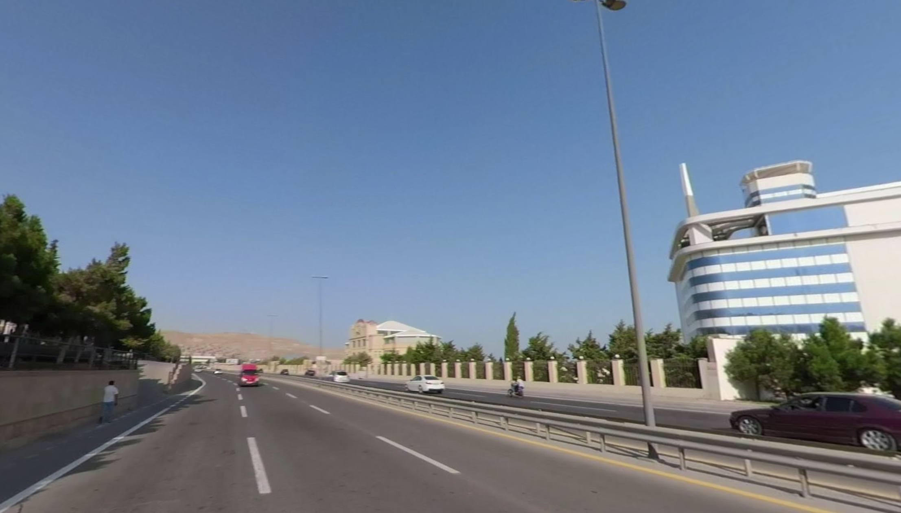
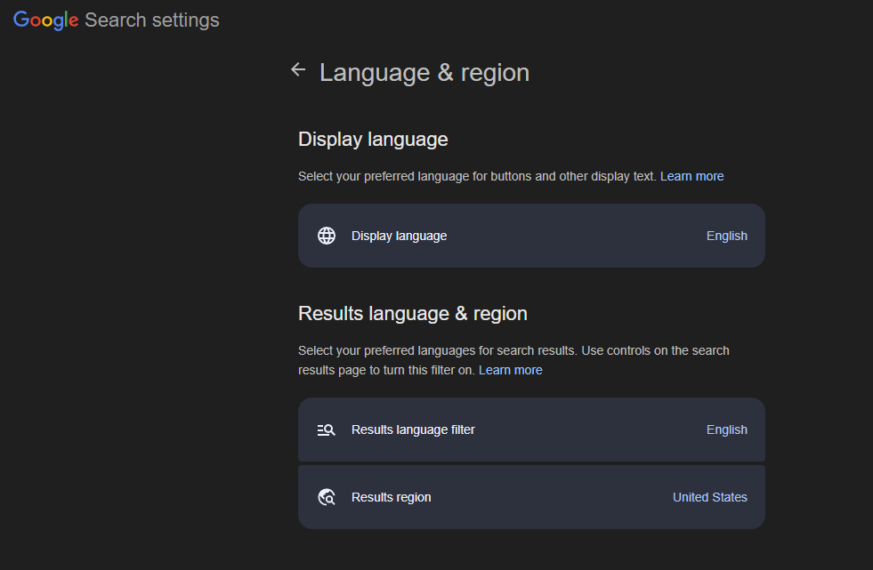
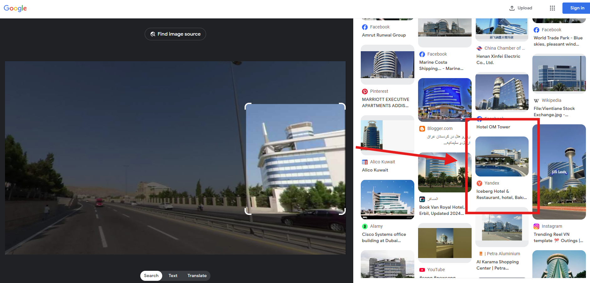
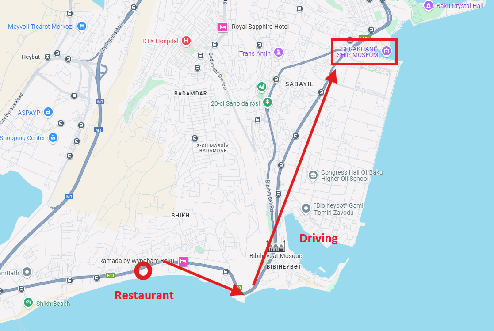
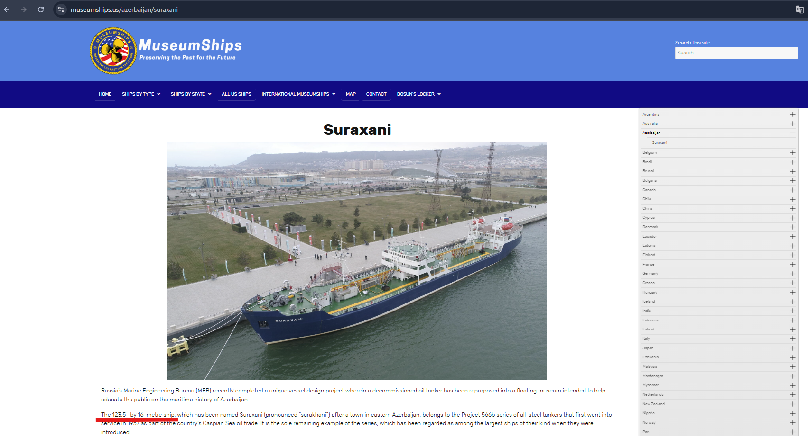

# ship

## 問題文

We found the ship while we were driving around after eating at a restaurant. I wonder what the name of that ship was. Can you look up the name because I would like to go back to the cafe in that ship? 
Flag format: FLAG{name of ship, length overall (meters), beam (meters)} 
Example: FLAG{Titanic,269.1,28.2}

## 解法

上記の画像が与えられる。

Googleレンズを使用して画像検索を行ってみる。

まず、日本ではなく海外（右車線）なのでGoogleの検索言語設定を英語圏に変更する。

特徴的な画像に絞って画像検索を行ってみると似たような画像が見つかる。

この画像のWebサイトに行き場所を特定する。

その後、問題文から下記のように予測する。

「We found the ship while we were driving around after eating at a restaurant. 」→ 写真の方向にドライブした先に船？

「the cafe in that ship」→ 常に停泊しているのでは？

画像の進行方向に常に停泊している船がないか地図で確認する。

船を見つけることができたため、その船についてのWebサイトを探す。

船の名前、全長、幅の情報を得ることができた。

また、このサイト内から船の中にカフェがあることが確認できる。
