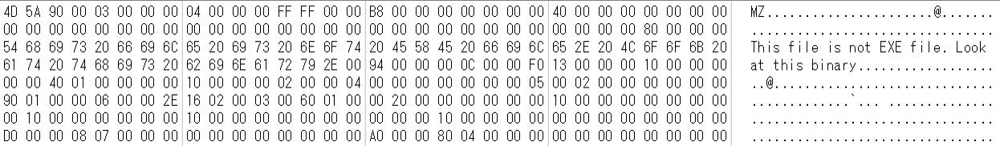
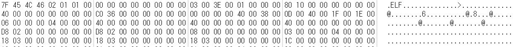

# Liar

## 問題文

Huh? That's strange... this EXE file doesn't work?

## 解法
ファイルのバイナリを確認する問題。 

1. ファイルのバイナリを見ると、「This file is not EXE file」とあるので、このファイルはEXEファイルではないということが推測できる。

2. さらに、少し下のバイナリをみると「ELF」という記述がある。

3. ELFより上のバイナリを削除し、Linux環境などで実行するとFlagが得られる。

