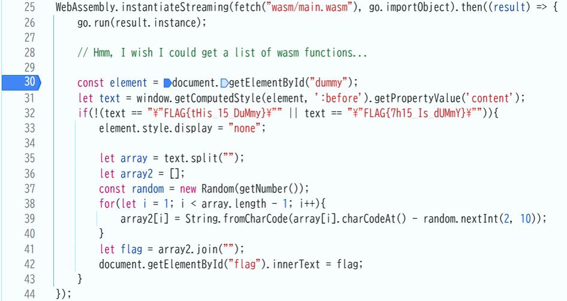
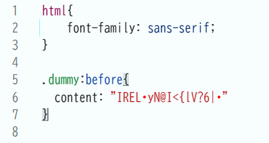

# dummy

## 問題文

This FLAG is...a dummy!?

## 解法
Webアセンブリを解析する問題 

1. HTMLを確認すると、存在しない「style.css」を呼び出そうとしているが、エラーで「dummy.css」が呼び出されている。

2. ソースの「main.js」と「wasm_exec.js」を見ると、Go言語からコンパイルされたWebアセンブリを使用していることが分かる。

3. 「wasm_exec.js」で「globalThis」というオブジェクトに関数の一覧を入れているのが確認できる。

4. コンソールで「globalThis」の中身を見ると「getTrueCSS」という関数を確認でき、コンソールで関数を呼び出してみると、style.cssの中身が出力される。

5. 「main.js」のdummy要素読み取り前にbreakpointを貼り、cssを書き換えることで正しく実行されFlagが表示される。

